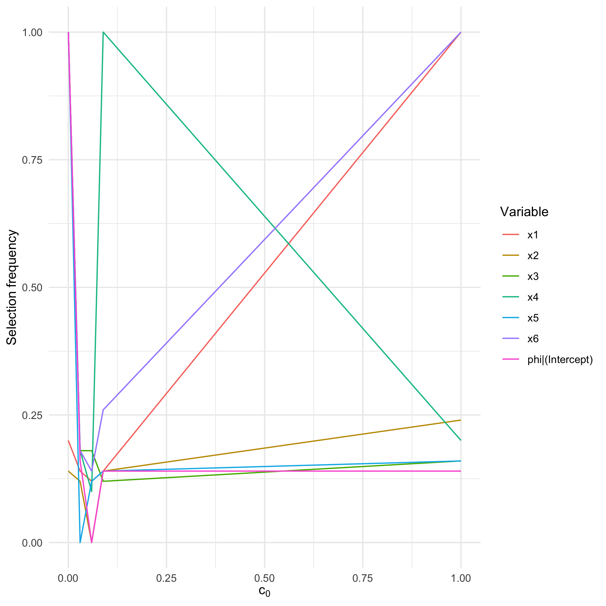
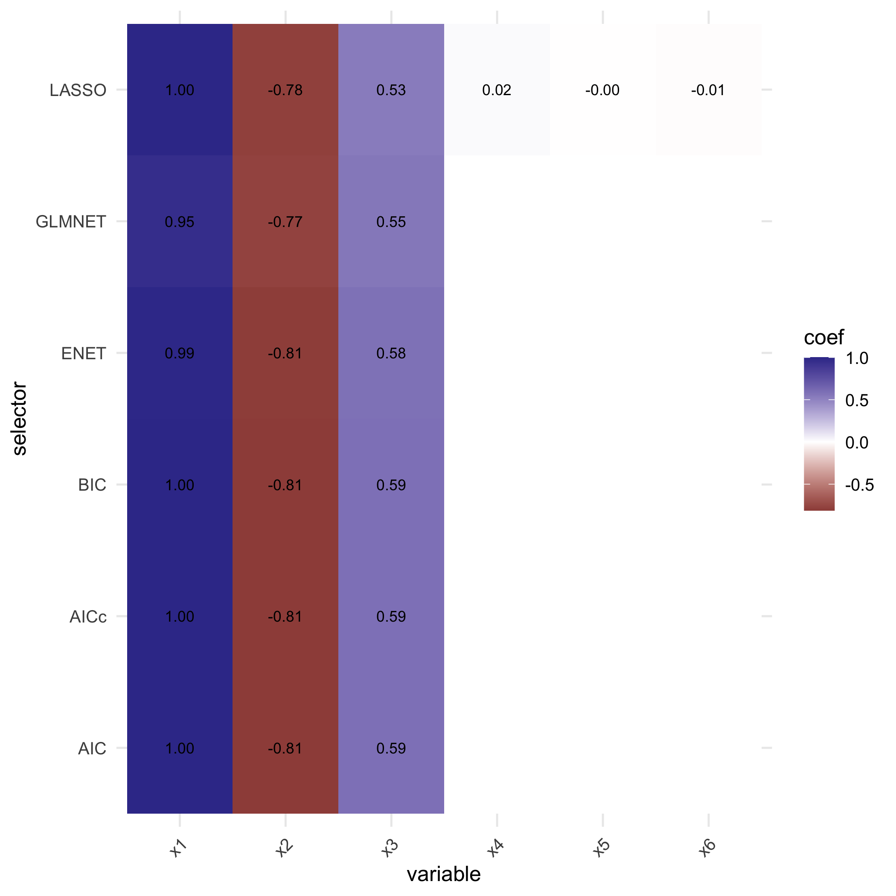

<!-- README.md is generated from README.Rmd. Please edit that file -->


# SelectBoost.beta 

<!-- badges: start -->
<!-- [](https://doi.org/10.32614/CRAN.package.SelectBoost.beta) -->
<!-- [](https://cran.r-project.org/package=SelectBoost.beta) -->
[](https://github.com/fbertran/SelectBoost.beta/actions/workflows/R-CMD-check.yaml)
[](https://github.com/fbertran/SelectBoost.beta/actions/workflows/rhub.yaml)
<!-- badges: end -->


With the growth of big data, variable selection has become one of the major challenges in statistics. Although many methods have been proposed in the literature their performance in terms of recall and precision are limited in a context where the number of variables by far exceeds the number of observations or in a high correlated setting. 

Results: 

`SelectBoost.beta` brings the correlation-aware resampling strategy of the original SelectBoost package to **beta** regression by implementing an extension of the **SelectBoost** algorithm, F. Bertrand, I. Aouadi, N. Jung, R. Carapito, L. Vallat, S. Bahram, M. Maumy-Bertrand (2015) <https://doi.org/10.1093/bioinformatics/btaa855> and <https://doi.org/10.32614/CRAN.package.SelectBoost>.


It ships with:

- wrappers such as `betareg_step_aic()` and `betareg_glmnet()` that act as base
  selectors for beta-distributed outcomes, now including optional precision
  (phi) submodel search and observation weights;
- helper functions (`sb_normalize()`, `sb_group_variables()`,
  `sb_resample_groups()`, …) mirroring the core stages of SelectBoost; and
- the high-level `sb_beta()` driver that orchestrates normalisation,
  correlation analysis, grouped resampling and stability tallying in a single
  call.

Each resampling call returns per-group diagnostics (cached draws, observed
correlation summaries) and `sb_beta()` threads the same correlated surrogates
across all thresholds so cross-level comparisons remain aligned. Interval
responses are supported through the `interval` argument, which reuses the
`fastboost_interval()` logic directly inside `sb_beta()`.

The package is designed so that each stage of the workflow remains reusable on
its own. Users can plug in custom grouping strategies or selectors while still
benefiting from correlated resampling.


## Conference presentations

The SelectBoost4Beta approach was presented by Frédéric Bertrand and Myriam
Maumy at the Joint Statistical Meetings 2023 in Toronto ("Improving variable
selection in Beta regression models using correlated resampling") and at
BioC2023 in Boston ("SelectBoost4Beta: Improving variable selection in Beta
regression models"). Both communications highlighted how correlated resampling boosts
variable selection for Beta regression in high-dimensional, strongly correlated
settings.

## Installation

SelectBoost.beta is preparing for its first CRAN submission. Until it becomes
available there, install the development version from GitHub:


``` r
devtools::install_github("fbertran/SelectBoost.beta")
```

Once the package lands on CRAN, the usual `install.packages("SelectBoost.beta")`
command will work as expected.

The selectors rely on the `betareg`, `glmnet`, and `gamlss` ecosystems. These
packages will be pulled in automatically when installing from source.

## Quick start

Simulate a correlated design, run the manual SelectBoost steps with
`betareg_step_aic()`, and compute selection frequencies:


``` r
library(SelectBoost.beta)
set.seed(42)

sim <- simulation_DATA.beta(n = 150, p = 6, s = 3, beta_size = c(1, -0.8, 0.6))
X_norm <- sb_normalize(sim$X)
corr_mat <- sb_compute_corr(X_norm)
groups <- sb_group_variables(corr_mat, c0 = 0.6)
resamples <- sb_resample_groups(X_norm, groups, B = 50)
coef_path <- sb_apply_selector_manual(X_norm, resamples, sim$Y, betareg_step_aic)
sel_freq <- sb_selection_frequency(coef_path, version = "glmnet")
sel_freq
#>              x1              x2              x3              x4              x5              x6 
#>               1               1               1               0               0               0 
#> phi|(Intercept) 
#>               1

attr(resamples, "diagnostics")
#>   group size regenerated cached mean_abs_corr_orig mean_abs_corr_surrogate mean_abs_corr_cross
#> 1    x1    1           0  FALSE                 NA                      NA                  NA
#> 2    x2    1           0  FALSE                 NA                      NA                  NA
#> 3    x3    1           0  FALSE                 NA                      NA                  NA
#> 4    x4    1           0  FALSE                 NA                      NA                  NA
#> 5    x5    1           0  FALSE                 NA                      NA                  NA
#> 6    x6    1           0  FALSE                 NA                      NA                  NA
```

The `sb_beta()` wrapper performs the entire loop internally and returns a matrix
indexed by the correlation thresholds used during resampling:


``` r
sb <- sb_beta(sim$X, sim$Y, B = 50, step.num = 0.25,use.parallel = FALSE)
print(sb)
#> SelectBoost beta selection frequencies
#> Selector: betareg_step_aic
#> Resamples per threshold: 50
#> Interval mode: none
#> c0 grid: 1.000, 0.089, 0.059, 0.030, 0.000
#> Inner thresholds: 0.089, 0.059, 0.030
#>              x1   x2   x3   x4   x5   x6 phi|(Intercept)
#> c0 = 1.000 1.00 1.00 1.00 0.00 0.00 0.00               1
#> c0 = 0.089 0.24 0.14 0.14 0.18 0.14 0.18               1
#> c0 = 0.059 0.16 0.14 0.26 0.10 0.12 0.16               1
#> c0 = 0.030 0.20 0.14 0.14 0.12 0.18 0.20               1
#> c0 = 0.000 0.16 0.12 0.12 0.14 0.18 0.14               1
#> attr(,"c0.seq")
#> [1] 1.00000000 0.08894615 0.05949716 0.03010630 0.00000000
#> attr(,"steps.seq")
#> [1] 0.08894615 0.05949716 0.03010630
#> attr(,"B")
#> [1] 50
#> attr(,"selector")
#> [1] "betareg_step_aic"
#> attr(,"resample_diagnostics")
#> attr(,"resample_diagnostics")$`c0 = 1.000`
#> [1] group                   size                    regenerated            
#> [4] cached                  mean_abs_corr_orig      mean_abs_corr_surrogate
#> [7] mean_abs_corr_cross    
#> <0 rows> (or 0-length row.names)
#> 
#> attr(,"resample_diagnostics")$`c0 = 0.089`
#>      group size regenerated cached mean_abs_corr_orig mean_abs_corr_surrogate
#> 1    x1,x4    2          50  FALSE         0.08894615              0.10146558
#> 2 x2,x3,x6    3          50  FALSE         0.07694401              0.09829963
#> 3 x2,x3,x5    3          50  FALSE         0.08217406              0.09634851
#> 4    x3,x5    2          50  FALSE         0.09286939              0.09536360
#> 5    x2,x6    2          50  FALSE         0.10556609              0.11060608
#>   mean_abs_corr_cross
#> 1          0.07089570
#> 2          0.06673431
#> 3          0.06390166
#> 4          0.05329723
#> 5          0.07179976
#> 
#> attr(,"resample_diagnostics")$`c0 = 0.059`
#>            group size regenerated cached mean_abs_corr_orig mean_abs_corr_surrogate
#> 1    x1,x2,x3,x4    4          50  FALSE         0.06136428              0.08621443
#> 2 x1,x2,x3,x5,x6    5          50  FALSE         0.06152013              0.08582089
#> 3    x1,x2,x3,x5    4          50  FALSE         0.07198271              0.08974742
#> 4       x1,x4,x5    3          50  FALSE         0.06290784              0.07535777
#> 5    x2,x3,x4,x5    4          50  FALSE         0.05766823              0.08028623
#> 6          x2,x6    2           0   TRUE         0.10556609              0.11060608
#>   mean_abs_corr_cross
#> 1          0.06598362
#> 2          0.06337853
#> 3          0.06489135
#> 4          0.06047434
#> 5          0.06062214
#> 6          0.07179976
#> 
#> attr(,"resample_diagnostics")$`c0 = 0.030`
#>               group size regenerated cached mean_abs_corr_orig mean_abs_corr_surrogate
#> 1    x1,x2,x3,x4,x5    5          50  FALSE         0.06203296              0.08360476
#> 2    x1,x2,x3,x5,x6    5           0   TRUE         0.06152013              0.08582089
#> 3       x1,x4,x5,x6    4          50  FALSE         0.04694388              0.07252823
#> 4 x1,x2,x3,x4,x5,x6    6          50  FALSE         0.05666305              0.08518211
#> 5    x2,x3,x4,x5,x6    5          50  FALSE         0.05591031              0.08187888
#>   mean_abs_corr_cross
#> 1          0.06487303
#> 2          0.06337853
#> 3          0.06954473
#> 4          0.06383341
#> 5          0.06182501
#> 
#> attr(,"resample_diagnostics")$`c0 = 0.000`
#>               group size regenerated cached mean_abs_corr_orig mean_abs_corr_surrogate
#> 1 x1,x2,x3,x4,x5,x6    6           0   TRUE         0.05666305              0.08518211
#>   mean_abs_corr_cross
#> 1          0.06383341
#> 
#> attr(,"interval")
#> [1] "none"
```

The result stores the selector used, the number of resamples, and the
correlation thresholds in its attributes. Dedicated methods make these easier to
inspect programmatically:


``` r
summary(sb)
#> SelectBoost beta summary
#> Selector: betareg_step_aic
#> Resamples per threshold: 50
#> Interval mode: none
#> c0 grid: 1.000, 0.089, 0.059, 0.030, 0.000
#> Inner thresholds: 0.089, 0.059, 0.030
#> Top rows:
#>        c0        variable frequency
#> 1  1.0000              x1      1.00
#> 2  1.0000              x2      0.24
#> 3  1.0000              x3      0.16
#> 4  1.0000              x4      0.20
#> 5  1.0000              x5      0.16
#> 6  1.0000              x6      1.00
#> 7  1.0000 phi|(Intercept)      0.14
#> 8  0.0889              x1      0.14
#> 9  0.0889              x2      0.14
#> 10 0.0889              x3      0.12
if (requireNamespace("ggplot2", quietly = TRUE)) {
  autoplot.sb_beta(sb)
}
```

<div class="figure">

<p class="caption">plot of chunk unnamed-chunk-28</p>
</div>


``` r
attr(sb, "selector")
#> [1] "betareg_step_aic"
attr(sb, "c0.seq")
#> [1] 1.00000000 0.08894615 0.05949716 0.03010630 0.00000000
attr(sb, "resample_diagnostics")[[1]]
#> [1] group                   size                    regenerated            
#> [4] cached                  mean_abs_corr_orig      mean_abs_corr_surrogate
#> [7] mean_abs_corr_cross    
#> <0 rows> (or 0-length row.names)
```


``` r
single <- compare_selectors_single(sim$X, sim$Y, include_enet = TRUE)
```


``` r
freq <- suppressWarnings(compare_selectors_bootstrap(
  sim$X, sim$Y, B = 100, include_enet = TRUE, seed = 321
))
head(freq)
#>    selector variable freq
#> x1      AIC       x1 1.00
#> x2      AIC       x2 1.00
#> x3      AIC       x3 1.00
#> x4      AIC       x4 0.27
#> x5      AIC       x5 0.14
#> x6      AIC       x6 0.19
```


``` r
plot_compare_coeff(single$table)
```

<div class="figure">

<p class="caption">plot of chunk unnamed-chunk-32</p>
</div>


``` r
plot_compare_freq(freq)
```

<div class="figure">

<p class="caption">plot of chunk unnamed-chunk-33</p>
</div>

### Interval outcomes

`sb_beta()` can draw pseudo-responses from observed intervals by supplying
`Y_low`, `Y_high`, and an `interval` mode:


``` r
interval_fit <- sb_beta(
  sim$X,
  Y_low = pmax(sim$Y - 0.05, 0),
  Y_high = pmin(sim$Y + 0.05, 1),
  interval = "uniform",
  B = 30,
  step.num = 0.5
)
attr(interval_fit, "interval")
#> [1] "uniform"
attr(interval_fit, "resample_diagnostics")
#> $`c0 = 1.000`
#> [1] group                   size                    regenerated            
#> [4] cached                  mean_abs_corr_orig      mean_abs_corr_surrogate
#> [7] mean_abs_corr_cross    
#> <0 rows> (or 0-length row.names)
#> 
#> $`c0 = 0.059`
#>            group size regenerated cached mean_abs_corr_orig mean_abs_corr_surrogate
#> 1    x1,x2,x3,x4    4          30  FALSE         0.06136428              0.08625551
#> 2 x1,x2,x3,x5,x6    5          30  FALSE         0.06152013              0.08351693
#> 3    x1,x2,x3,x5    4          30  FALSE         0.07198271              0.09395737
#> 4       x1,x4,x5    3          30  FALSE         0.06290784              0.08889440
#> 5    x2,x3,x4,x5    4          30  FALSE         0.05766823              0.08401650
#> 6          x2,x6    2          30  FALSE         0.10556609              0.08760037
#>   mean_abs_corr_cross
#> 1          0.06004899
#> 2          0.07278975
#> 3          0.06294279
#> 4          0.07196982
#> 5          0.06221965
#> 6          0.06647446
#> 
#> $`c0 = 0.000`
#>               group size regenerated cached mean_abs_corr_orig mean_abs_corr_surrogate
#> 1 x1,x2,x3,x4,x5,x6    6          30  FALSE         0.05666305              0.08808704
#>   mean_abs_corr_cross
#> 1          0.05790142
```

### Parallel resampling

Setting `use.parallel = TRUE` instructs `sb_beta()` and `sb_resample_groups()` to
dispatch resamples and selector fits through
[`future.apply`](https://future.apply.futureverse.org/). Bring your own
`future::plan()` to select the desired backend (e.g. `multisession` on desktops):


``` r
future::plan(future::multisession)
sb_parallel <- sb_beta(sim$X, sim$Y, B = 50, step.num = 0.25, use.parallel = TRUE)
future::plan(future::sequential)
```

Refer to the vignettes for a more detailed walk-through of the workflow and the
pseudo-code underpinning the algorithms.
